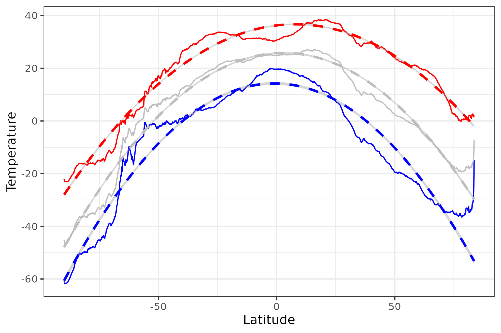

# Temperature Latitudes

Here I store some temperature data taken from Rezende and Bozinovic (2019) and do some regressions on it as a function of latitude. 

---

Rezende, Enrico L., and Francisco Bozinovic. ‘Thermal Performance across Levels of Biological Organization’. Philosophical Transactions of the Royal Society B: Biological Sciences 374, no. 1778 (5 August 2019): 20180549. https://doi.org/10.1098/rstb.2018.0549.
